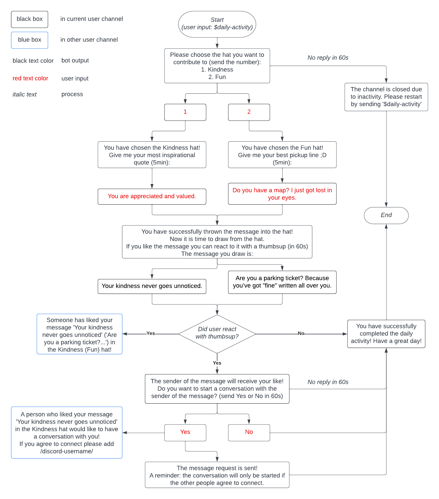
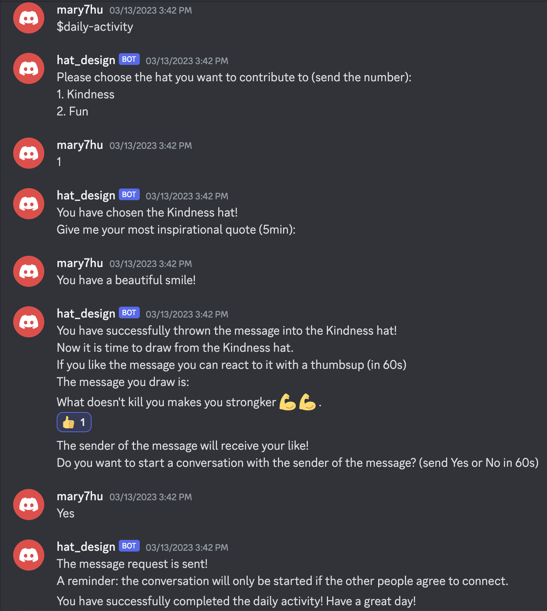
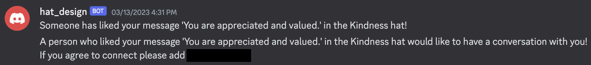

# ThatHat Discord Bot Simulation

## Some Background...
We discovered that nowadays people tend to spend excessive time on social media, causing problems like social comparison and anxiety for individuals. Therefore, we designed a social media app ThatHat that allows users to send and receive themes messages anonymously (aka droping/pulling messages from hats with different topics). Notably, users can only send and receive messages for a maximum of 2 times per day, this limitation ensures healthy social interactions are achieved.

This project is a prototype for this social media app that simulates the daily activity of users, written in Python in the form of a Discord Bot. It was used in the second round of user testing and provided valuable feedback for our team.

## General Flowchart

## Example Screenshots
Screenshot from user's side:

Screenshot from messenger's side:

## Final Portfolio Page
Here's our [Final Portfolio Page](https://sites.google.com/ucsd.edu/thathat) (https://sites.google.com/ucsd.edu/thathat), if you are interested in our final Figma prototype.